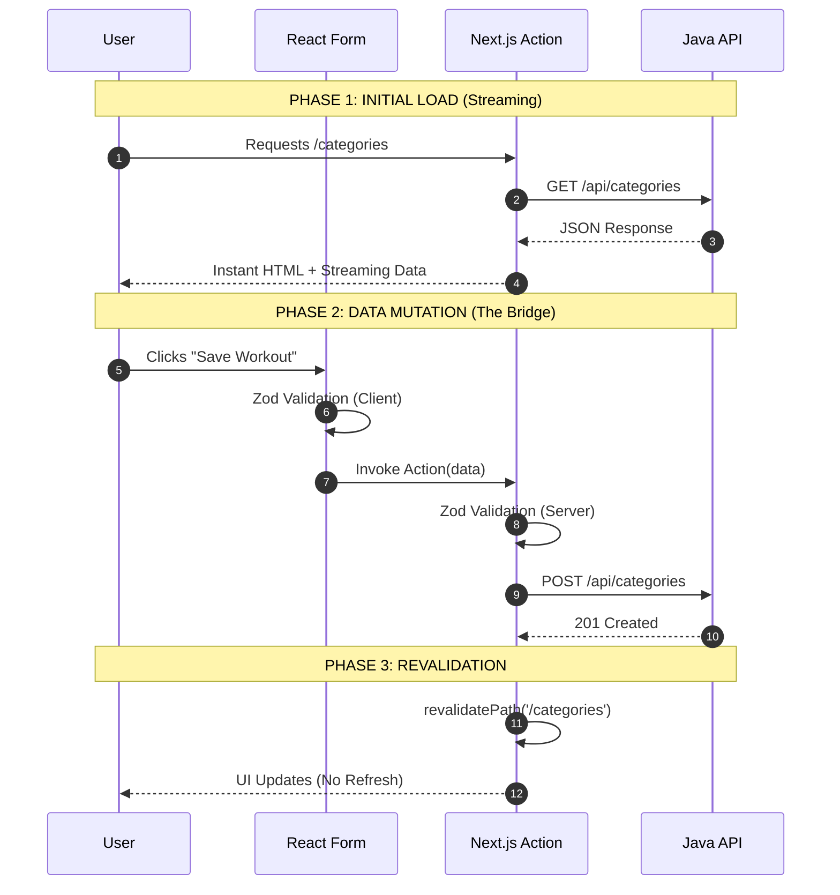

# Gym Tracker

A workout tracking application built with the **Next.js Architecture**, **Shadcn/UI**, and a **Java Spring Boot** backend.

---

## Data Flow Diagram

```mermaid
sequenceDiagram
    autonumber

    %% Use distinct actors
    participant U as User
    participant C as React Form
    participant SA as Next.js Action
    participant J as Java API

    Note over U, J: PHASE 1: INITIAL LOAD (Streaming)
    U->>SA: Requests /categories
    SA->>J: GET /api/categories
    J-->>SA: JSON Response
    SA-->>U: Instant HTML + Streaming Data

    Note over U, J: PHASE 2: DATA MUTATION (The Bridge)
    U->>C: Clicks "Save Workout"
    C->>C: Zod Validation (Client)
    C->>SA: Invoke Action(data)
    SA->>SA: Zod Validation (Server)
    SA->>J: POST /api/categories
    J-->>SA: 201 Created

    Note over U, J: PHASE 3: REVALIDATION
    SA->>SA: revalidatePath('/categories')
    SA-->>U: UI Updates (No Refresh)
```

---
